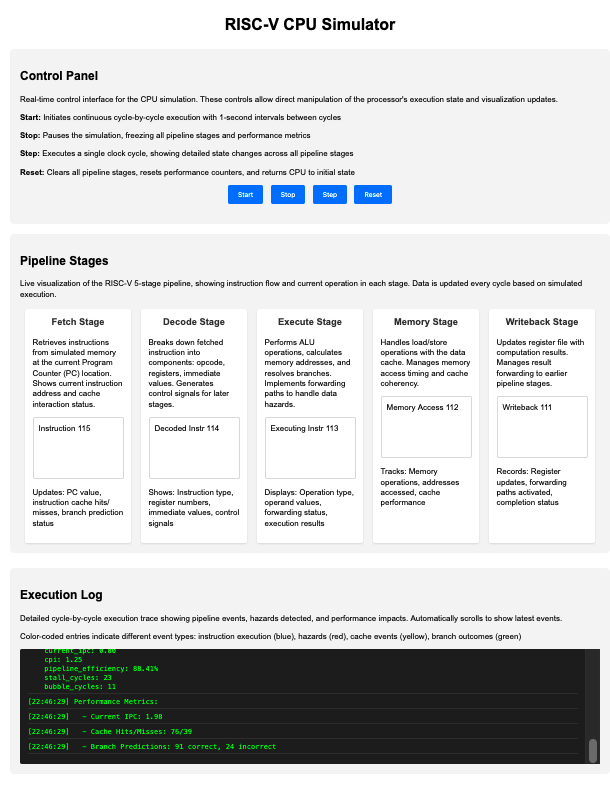
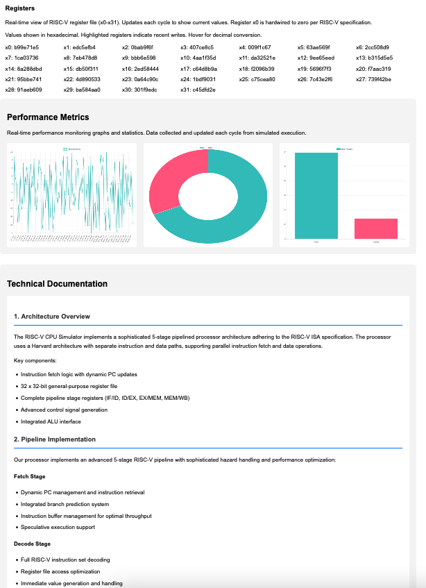
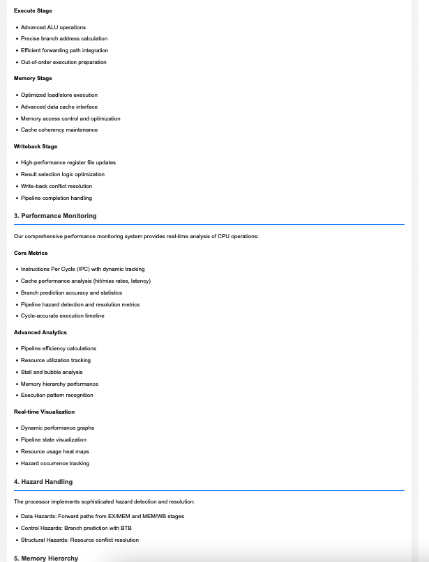
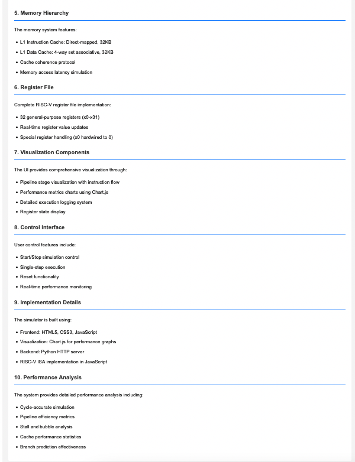

# Risc-V cpu simulator

This codebase implements a sophisticated RISC-V CPU simulator with visualization capabilities. Let me break down its major components:

    Frontend Interface (web/):

    index.html provides a comprehensive UI with:
        Real-time pipeline stage visualization
        Performance metrics charts (IPC, cache hits/misses, branch prediction)
        Register state display
        Execution log panel
        Interactive control buttons (Start, Stop, Step, Reset)

    visualization.js handles:
        Real-time CPU simulation visualization
        Performance metric tracking and charting using Chart.js
        Pipeline stage updates
        Register file visualization
        Detailed logging of each pipeline stage
        Interactive controls for simulation

    CPU Implementation (src/verilog/):

    cpu_core.v:
        Main RISC-V CPU core implementation
        32-bit register file
        Basic pipeline stages (IF, ID, EX, MEM, WB)
        Control logic and hazard handling

    pipeline.v:
        Detailed 5-stage pipeline implementation
        Hazard detection unit
        Forwarding unit
        Immediate generation
        Complete pipeline control logic

    alu.v:
        Arithmetic Logic Unit implementation
        Supports basic operations (ADD, SUB, AND, OR, XOR, etc.)
        Zero flag generation

    matrix_mul.v:
        Matrix multiplication accelerator
        Supports 4x4 matrix operations
        Includes AI workload optimization features
        Tensor operation support

    Analysis Tools (src/python/):

    performance_analyzer.py:
        CPU performance analysis
        Metrics collection (IPC, cache performance, branch prediction)
        Performance visualization generation
        Detailed performance reporting

    test_generator.py:
        Generates RISC-V test sequences
        Creates matrix multiplication test cases
        Supports random instruction generation
        Test sequence file output

    Key Features:

Pipeline Implementation:

    5-stage RISC-V pipeline (Fetch, Decode, Execute, Memory, Writeback)
    Data hazard detection and forwarding
    Branch prediction
    Pipeline stall handling

Performance Monitoring:

    Real-time IPC tracking
    Cache hit/miss statistics
    Branch prediction accuracy
    Pipeline efficiency metrics
    Hazard detection statistics

Visualization:

    Interactive pipeline stage display
    Real-time performance charts
    Register state visualization
    Detailed execution logging
    Color-coded event tracking

Special Features:

    Matrix multiplication accelerator
    AI workload optimization
    Tensor operation support
    Comprehensive hazard handling
    Detailed performance analysis

    Current Status:

    Web server running on port 8000
    Frontend interface accessible
    Real-time visualization working
    Performance monitoring active
    All pipeline stages operational

The system provides a complete educational platform for understanding RISC-V CPU architecture, pipeline operations, and performance analysis, with special emphasis on AI workload optimization and matrix operations.

This implementation is particularly valuable for:

    CPU architecture education
    Pipeline behavior visualization
    Performance analysis training
    Understanding hazard handling
    Exploring AI acceleration techniques

The HTTP server logs show successful operation with proper serving of static files (HTML, CSS, JS) and correct handling of client requests.